## Running the Amazon S3 Personal File Store Sample with Web Identity Federation and Amazon Authentication

This _Amazon S3 Personal File Store_ sample is fully detailed in the [web identity federation](http://aws.amazon.com/articles/4617974389850313) article. The sample demonstrates how to use AWS Security Token Service (STS) to give application users specific and constrained permissions to an Amazon S3 bucket. Each application user will get a "folder" of an Amazon S3 bucket as specified by the role policy. This README details all the steps necessary to get the sample running with Amazon Authentication. It assumes you've alredy completed the steps in the [base README](README.md) for setting up the application with Facebook:

### 1. Create an Amazon application and iOS API key

  1. Visit the [Getting Started for iOS](http://login.amazon.com/ios) guide and follow the instructions to **Register a New Application**. Make sure to take note of your `App ID`. You'll use it in later steps. The other steps in this guide will be useful with your future Login with Amazon apps, but will not be necessary for this sample.  
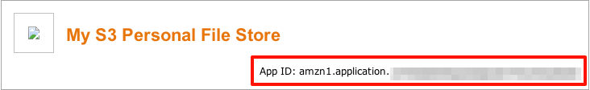

  2. Under **Label** give the key a meaningful name.
  3. Enter the following as your **Bundle ID**: `com.amazon.aws.demo.s3personalfilestore.S3PersonalFileStore`.  
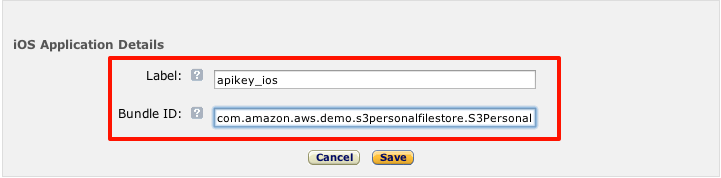

  4. Make sure to click **Get API Key Value** after creating your API key. This value is used in configuring the sample.  
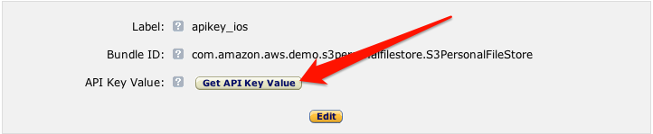

### 2. Create your role for web identity federation

  1. Visit the [AWS Management Console](https://console.aws.amazon.com/iam/home) to create a **new** role.  
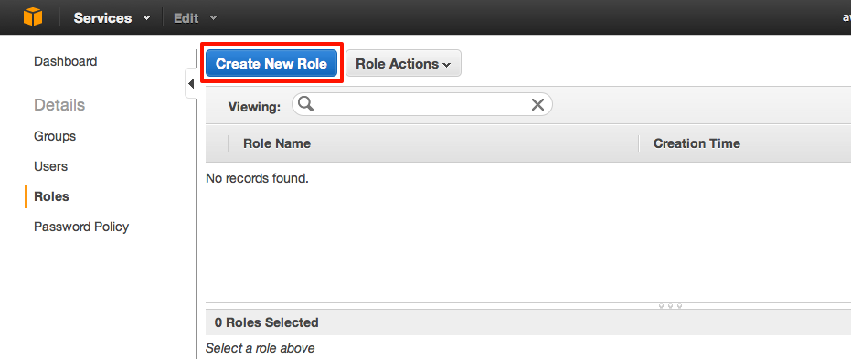

  2. Give your role a meaningful name, such as **AmazonWIFS3FileStore**.  
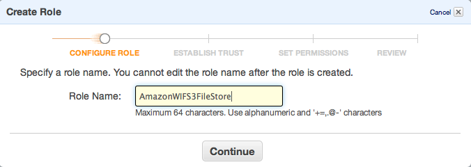

  3. Select **Role For Web Identity Provider Access** as your Role Type.  
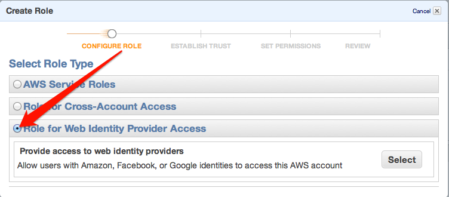

  4. Select Login with Amazon as the Identity Provider and provide the application ID you generated with Amazon.  
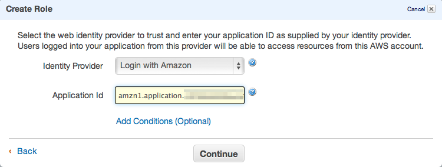

  5. Click Continue when prompted to verify the role trust policy.
  6. Select **Custom Policy** when asked to set permissions. This allows us to enter our policy as JSON.  
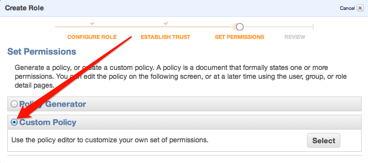

  7. Give the policy a name and enter the following JSON as the **Policy Document**, replacing `__BUCKET_NAME__` with the S3 bucket you created earlier: 
    
  ```     
      {
       "Version":"2012-10-17",
       "Statement":[{
         "Effect":"Allow",
         "Action":["s3:ListBucket"],
         "Resource":["arn:aws:s3:::__BUCKET_NAME__"],
         "Condition": 
           {"StringLike": 
             {"s3:prefix":"${www.amazon.com:user_id}/*"}
           }
        },
        {
         "Effect":"Allow",
         "Action":["s3:GetObject", "s3:PutObject", "s3:DeleteObject"],
         "Resource":[
             "arn:aws:s3:::__BUCKET_NAME__/${www.amazon.com:user_id}",
             "arn:aws:s3:::__BUCKET_NAME__/${www.amazon.com:user_id}/*"
         ]
        }
       ]
      }
  ```     

  8. Review the information you entered and click **Create Role** to finish creating your role.  
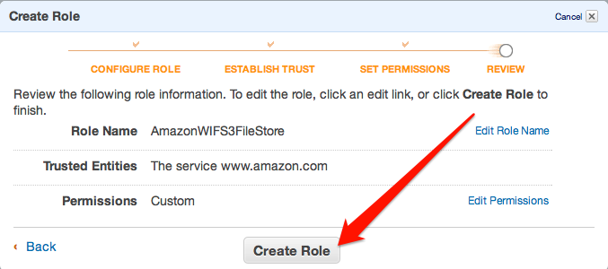

  9. Select the Role and switch to the **Summary** tab. Take note of the **Role ARN**; you'll use it in configuring the sample.  
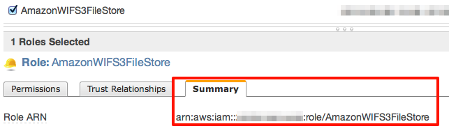

### 3. Update sample configuration

  1. Open the `S3PersonalFileStore.xcodeproj` in Xcode.
  2. Update Constants.h to enable Amazon login and with your role ARN: 
    
  ``` 
      #define AMZN_LOGIN         1
      #define AMZN_ROLE_ARN      @"ROLE_ARN"
  ```

  3. Switch to the project view and select the **S3PersonalFileStore** target
  4. Enter just your Amazon API key under **APIKey** in **Custom iOS Target Properties**  
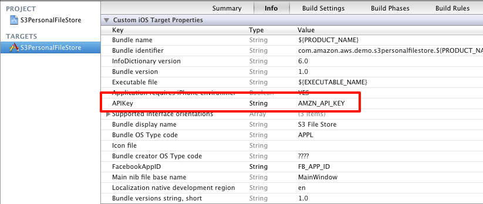

### 4. Run the sample

Run the sample on your simulator or device.

