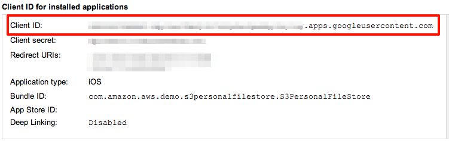
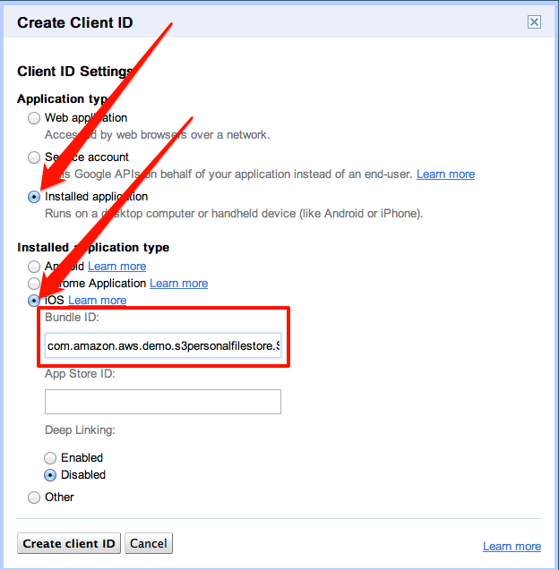
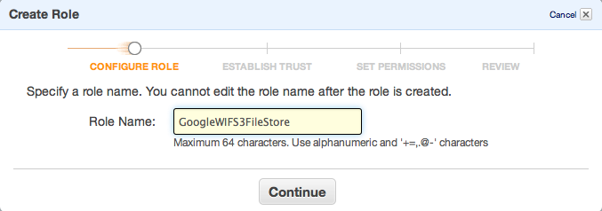
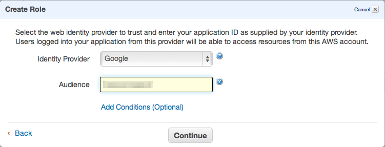
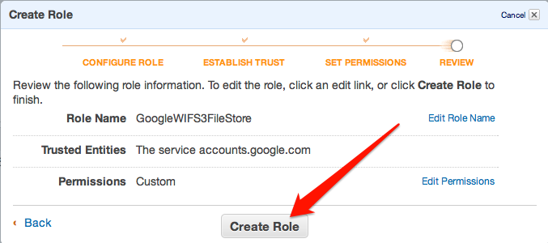
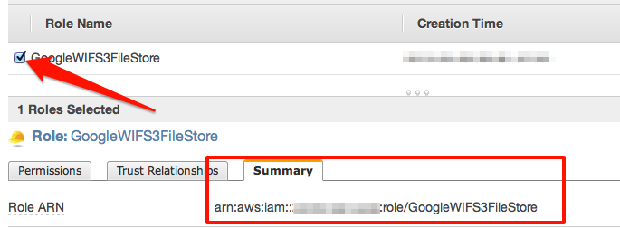

## Running the Amazon S3 Personal File Store Sample with Web Identity Federation and Google+ Authentication

This _Amazon S3 Personal File Store_ sample is fully detailed in the [web identity federation](http://aws.amazon.com/articles/4617974389850313) article. The sample demonstrates how to use AWS Security Token Service (STS) to give application users specific and constrained permissions to an Amazon S3 bucket. Each application user will get a "folder" of an Amazon S3 bucket as specified by the role policy. This README details all the steps necessary to get the sample running with Google+ Authentication. It assumes you've alredy completed the steps in the [base README](README.md) for setting up the application with Facebook:

### 1. Create a Google application and client ID

  1. Visit the [Quick start for iOS](https://developers.google.com/+/quickstart/ios) guide and follow the instructions to **Enable the Google+ API**. Make sure to take note of your `Client ID` as this will be used in later steps. The other steps in this guide will be useful with your future Google+ Apps, but will not be necessary for this sample.

  	

  2. Under **Application type** select **Installed application**. 
  3. Under **Installed application type**, select **iOS**.
  4. Enter the following as your **Bundle ID**: `com.amazon.aws.demo.s3personalfilestore.S3PersonalFileStore`.  


###2. Create the AWS Resources

You can **automate** the creation of AWS Resources or create them **manually**. **Skip** to step 3 for creating the resources **manually**. 

[AWS CloudFormation](https://console.aws.amazon.com/cloudformation/home) can be used to **automate** the creation of the resources thus **skipping step 3**. 

1. If you specified the Google Client Id (Android Application) at the time of stack creation you will already have the user role ARN needed in step 5. **Skip step 3** and **proceed** to step 4.

2. Otherwise **Update Stack** using the [template](https://github.com/awslabs/aws-sdk-ios-samples/blob/master/S3_WIF_PersonalFileStore/WIFCloudFormationTemplate.json) and follow the [instructions](https://mobile.awsblog.com/post/Tx3ILZHIKNTQQ83/Simplify-Web-Identity-Federation-Setup-with-AWS-CloudFormation) to add a new Web Identity Federation provider to the stack. Using the Google Client ID (Android Application), you will get the user role ARN required in later steps. **Skip step 3** and **proceed** to **step 4**. 

### 3. Create your role for web identity federation

**Skip to step 4 if you have already created user role using the instructions in step 2.**

  1. Visit the [AWS Management Console](https://console.aws.amazon.com/iam/home) to create a **new** role.  


  2. Give your role a meaningful name, such as **GoogleWIFS3FileStore**.  


  3. Select **Role for Web Identity Provider Access** as your role type.  


  4. Select Google as the Identity Provider and provide the **Client ID** you generated with Google.  


  5. Click Continue when prompted to verify the role trust policy.
  6. Select **Custom Policy** when asked to set permissions. This allows us to enter our policy as JSON.  


  7. Give the policy a name and enter the following JSON as the **Policy Document**, replacing `__BUCKET_NAME__` with the S3 bucket you created earlier: 
    
  ```
      {
       "Version":"2012-10-17",
       "Statement":[{
         "Effect":"Allow",
         "Action":["s3:ListBucket"],
         "Resource":["arn:aws:s3:::__BUCKET_NAME__"],
         "Condition": 
           {"StringLike": 
             {"s3:prefix":"${accounts.google.com:sub}/*"}
           }
        },
        {
         "Effect":"Allow",
         "Action":["s3:GetObject", "s3:PutObject", "s3:DeleteObject"],
         "Resource":[
             "arn:aws:s3:::__BUCKET_NAME__/${accounts.google.com:sub}",
             "arn:aws:s3:::__BUCKET_NAME__/${accounts.google.com:sub}/*"
         ]
        }
       ]
      }
  ```

  8. Review the information you entered and click **Create Role** to finish creating your role.  


  9. Select the Role and switch to the **Summary** tab. Take note of the **Role ARN**; you'll use it in configuring the sample.  


### 4. Download Google+ SDK and add to sample

  1. Visit the [Google+ iOS SDK](https://developers.google.com/+/mobile/ios/) and download the latest version of the SDK.  
**Note: The sample has been tested with version 1.3.0 of the Google+ iOS SDK. Future updates may require additional configuration.**
  2. Add the following files/directories from the SDK to the sample by dragging and dropping them into Xcode project:  
     * GooglePlus.framework  
     * GoogleOpenSource.framework
     * GooglePlus.bundle

### 5. Update sample configuration

Update Constants.h to enable Google login in the sample and set your role ARN
and client ID:

  ```
      #define GOOGLE_LOGIN         1
      #define GOOGLE_ROLE_ARN      @"ROLE_ARN"
      #define GOOGLE_CLIENT_ID     @"CLIENT_ID"
  ```
### 6. Google+ iOS SDK 1.5 configuration

Google+ iOS SDK 1.5 requires some additional configuration from the Google Developers Console.

1. Under the APIs & Auth option, select Consent Screen.
2. Provide an email address.
3. Provide the product name. 
4. Save the changes.

### 7. Run the sample

  1. Run the sample on your simulator or device.
  2. You may want to install the Google+ application on your device to see the native login experience.

