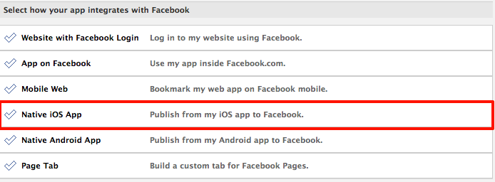
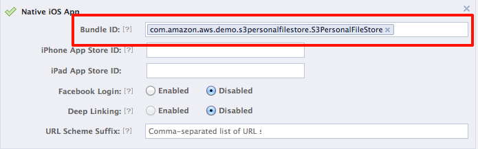
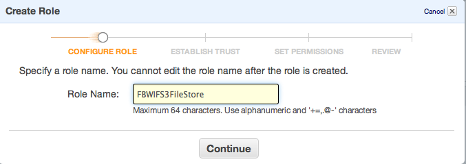
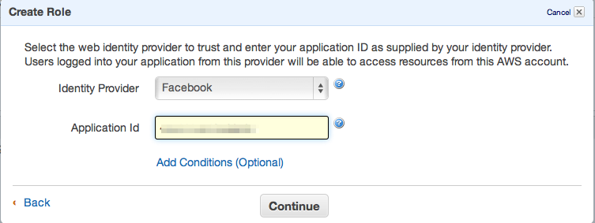
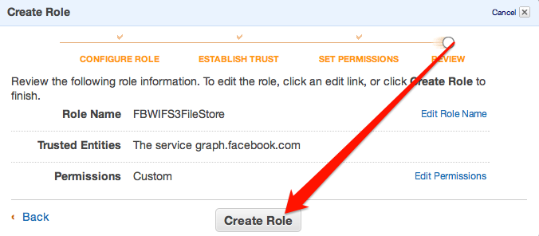
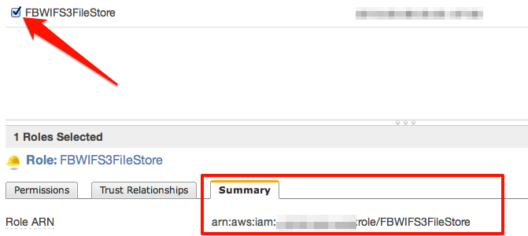
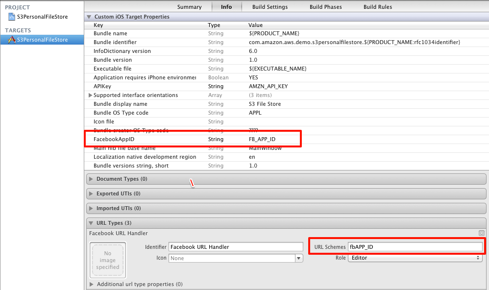

## Running the Amazon S3 Personal File Store Sample with Web Identity Federation

This _Amazon S3 Personal File Store_ sample is fully detailed in the [web identity federation](http://aws.amazon.com/articles/4617974389850313) article.  The sample demonstrates how to use AWS Security Token Service (STS) to give application users specific and constrained permissions to an Amazon S3 bucket.  Each application user will get a "folder" of an Amazon S3 bucket as specified by the role policy.  This README details all the steps necessary to get the sample fully running:

### 1. Create a Facebook application

1.  Sign up for the Facebook developer program at [developers.facebook.com](https://developers.facebook.com/)
2.  Visit the guide [Getting Started with the Facebook SDK for iOS](https://developers.facebook.com/docs/getting-started/facebook-sdk-for-ios/) and follow the instructions to **Create a Facebook App**. Make note of your `App ID`. You'll use it in configuring the sample. The other steps in this guide will be useful with your future Facebook Apps, but are not necessary for this sample.
    
3.  You may enter any reasonable values under **Basic Info**. These values do not affect the integration between the sample and Facebook.
4.  Under **Select how your app integrates with Facebook** select **Native iOS App**.
    
5.  Enter the following as your **Bundle ID**: `com.amazon.aws.demo.s3personalfilestore.S3PersonalFileStore`.
    

### 2. Create an Amazon S3 bucket to use for the sample.

Using the [AWS Management Console](https://console.aws.amazon.com/s3/home), create a **new** Amazon S3 bucket for testing with this sample.  The name you choose for the bucket is necessary for a number of steps to follow.

### 3. Create your Role for web identity federation

1.  Visit the [AWS Management Console](https://console.aws.amazon.com/iam/home) to create a **new** role.
    
2.  Give your role a meaningful name, such as **FBWIFS3FileStore**.
    
3.  Select **Role for Web Identity Provider Access** as your role type.
    
4.  Select Facebook as the **Identity Provider** and provide the application ID you generated with Facebook.
    
5.  Click Continue when prompted to verify the role trust policy.
6.  Select **Custom Policy** when asked to set permissions. This allows us to enter our policy as JSON.

7.  Give the policy a name and enter the following JSON as the **Policy Document**, replacing `__BUCKET_NAME__` with the S3 bucket you created earlier:

	```
	{
	 "Version":"2012-10-17",
	 "Statement":[{
	   "Effect":"Allow",
	   "Action":["s3:ListBucket"],
	   "Resource":["arn:aws:s3:::__BUCKET_NAME__"],
	   "Condition":     {"StringLike":       {"s3:prefix":"${graph.facebook.com:id}/*"}
	     }
	  },
	  {
	   "Effect":"Allow",
	   "Action":["s3:GetObject", "s3:PutObject", "s3:DeleteObject"],
	   "Resource":[
	       "arn:aws:s3:::__BUCKET_NAME__/${graph.facebook.com:id}",
	       "arn:aws:s3:::__BUCKET_NAME__/${graph.facebook.com:id}/*"
	   ]
	  }
	 ]
	}
	```

8.  Review the information you entered and click **Create Role** to finish creating your role.
    
9.  Select the role and switch to the **Summary** tab. Take note of the **Role ARN**; you'll use it in configuring the sample.
    

### 4. Update sample configuration

1.  Open the `S3PersonalFileStore.xcodeproj` in Xcode.
2.  Add the AWS SDK for iOS Frameworks to the sample.
	1.  In the Project Navigator, Right-Click on the Frameworks group.
	2.  In the Menu select Add Files to `UserPreference`
	3.  Navigate to the location where you downloaded and expanded the AWS SDK for iOS.
	4.  Select the following frameworks and click Add:
		*  AWSRuntime.framework
		*  AWSS3.framework
		*  AWSSecurityTokenService.framework
		*  ThirdParty (Which includes FacebookSDK.framework and login-with-amazon.)
3.  Update Constants.h with your bucket name and role ARN:

	```
	#define BUCKET_NAME      @"BUCKET_NAME"
	#define FB_ROLE_ARN      @"ROLE_ARN"
	```

4.  Switch to the project view and select the **S3PersonalFileStore** target
5.  Enter just your Facebook App ID under **Custom iOS Target Properties**
6.  Update the Facebook URL Handler `URL Schemes` as shown the following screenshot, using the form `**fb**#########`
**NOTE: the preceding 'fb' before the numeric App ID is REQUIRED.**

    

### 5. Run the sample

1.  Run the sample on your simulator or device.
2.  You may want to install the Facebook application on your device to see the native login experience.
