## Setup SNS Mobile Push

These instructions detail how to setup SNS Mobile Push for Amazon MessageBoard sample app.
### 1. Setup Provisioning Profiles and Certificates

1.	Log in to the [iOS Dev Center](https://developer.apple.com/ios) and Select "Certificates, Identifier & Profiles" from the right panel.

	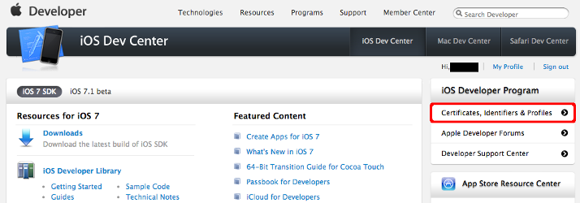
2.	Select **Certificates** in the **iOS Apps** section.
	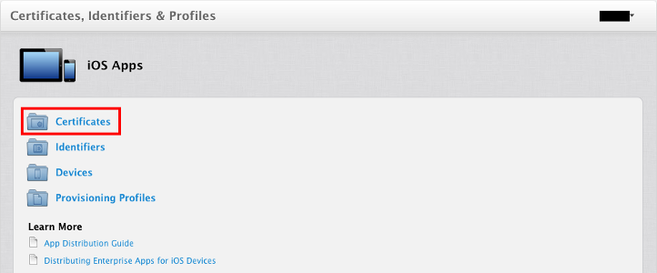
3.	Go to **App IDs** in the sidebar and click the **+** button.
	
4.	Fill the following details:
	*	App ID Description: MessageBoardSample
	*	Explicit App ID: com.amazon.aws.Message-Board
	*	Click ***Continue*** and then ***Submit***
	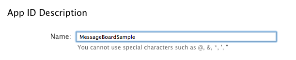
	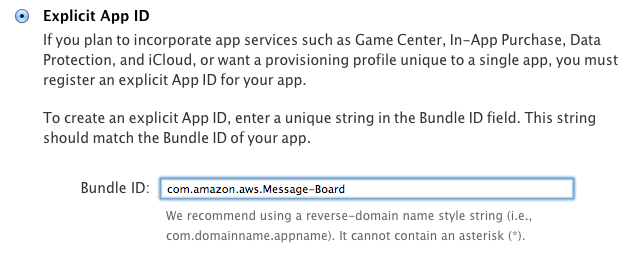
5.	Select the ***MessageBoardSample*** app ID from the list. This will open up an accordion as shown below, click ***Edit*** to configure these settings.

	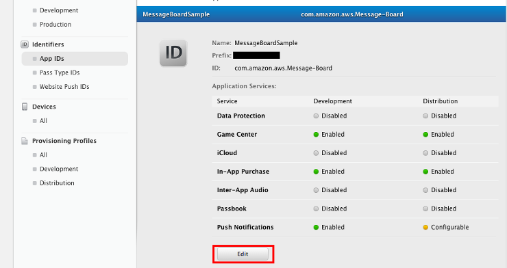
	*	Scroll down and click the checkbox to enable Push Notifications
	*	Click ***Create Certificate*** under Development SSL Certificate Section.
		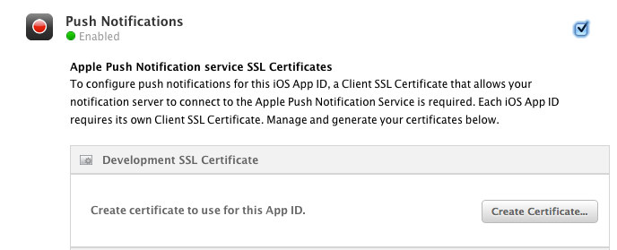
	*	Follow the guide to create and uploaded your CSR file, click ***Generate*** to generate your certificate and then click "Download" to download .cer file to your local machine.

6.	Double-click the .cer file to import it into your Keychain. Your keychain Access should be automatically opened.
	*	Select ***Certificates*** under the ***Category*** tab from the left panel.
	*	Find your certificate you just imported, the name should begin with "Apple Development iOS Push Servers…" and you should be able to expand the certificate to see a associated private key. 
	*	Right-click the certificate,then choose ***Export "Apple Development iOS Push Services…"***, Keychain Access is smart enough to include your private key assoicated with this certificate.
	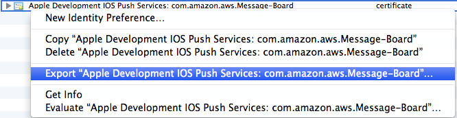
	*	Save the exported p12 file, you may have to create a password before saving.
	
### 2. Setup Amazon SNS Mobile Push

1.	Log in to the [AWS SNS Console in N.Virginia Region](https://console.aws.amazon.com/sns/home?region=us-east-1) and Click "Add a New App" to create a new application.
	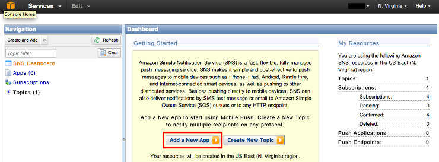
2.	Fill or Select the following details:
	*	**Application Name**: MessageBoardSample
	*	**Push Platform**: Apple Push Notification Service Sandbox (APNS_SANDBOX)
	
3.	Choose the p12 file you exported from keychain in last step and enter the password you created when saving the file.
4.	Click ***Load Credentials From File*** button, your certificates and private key fields should be automatically filled in below.
5.	Click ***Add New App*** to create a new application.
	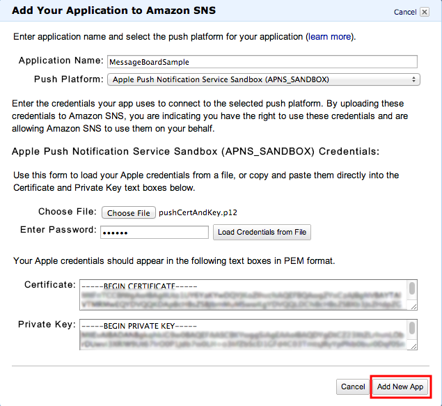
6.	Select the application ***MessageBoardSample (APNS_SANDBOX)*** you just created in the left panel, and the `Application ARN` will be shown in ***Application Details*** Section, make note of it and you will need it in the following step.
	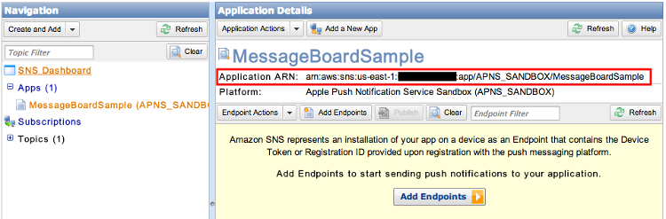

### 3.	Setup MessageBoard App

**It is assumed that you have already configured your Xcode project by following this** [README](readme.md)

1.	Open the `MessageBoard/MessageBoard.xcodeproj` project file in Xcode.
2.	Open the `Constants.h` file and modify the `PLATFORM_APPLICATION_ARN` definitions to the value shown on AWS SNS Console in previously step.
3.	Switch to project view and select the `Message Board` target.
4.	In the `Build Settings` tab, make sure `Code Signing Identity` has been set to **iOS Developer**
5.	Run the app on the physical device (not simulator).
6.	Tap ***SNS Mobile Push*** to navigate to Push Screen. 

	
7.	Tap ***Create Endpoint for The Device*** to add this device to your SNS endpoints list.

	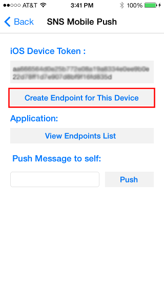
8.	Enter some words in the push textfield and tap ***Push*** button.

	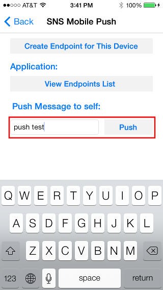
9.	An alert should pop up to indicate that a push notification has been received.

	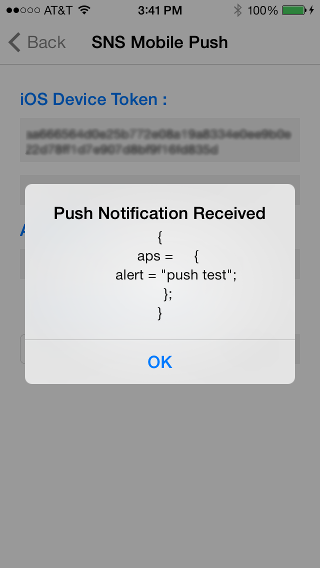

 
##### For more details about Amazon SNS Mobile Push, please visit [Amazon SNS Mobile Push Developer Guide](http://docs.aws.amazon.com/sns/latest/dg/SNSMobilePush.html)

	
	
	
